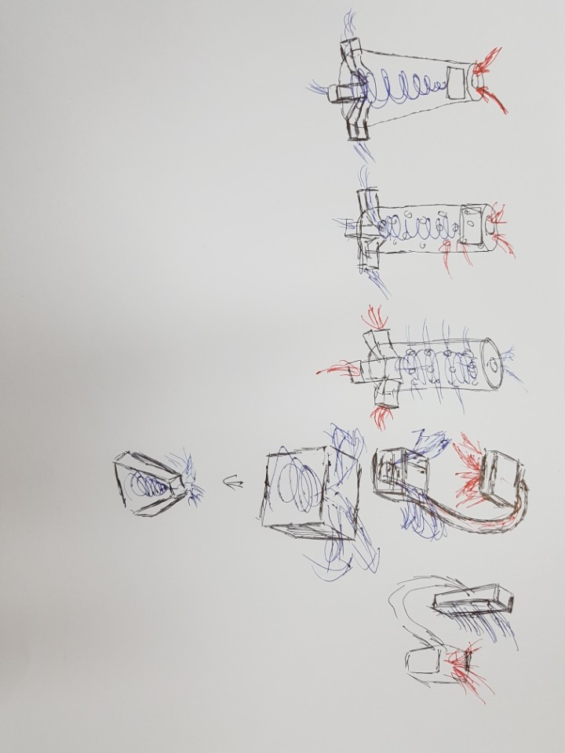

# 회의록 #2 2018. 1. 24(Wed)
> * 호서대학교 산학융합캠퍼스 강의동 504호 13시
> * 참석자: 류근호, 이상열, 김하진, 박희규

### 1. 한 주간 한 일 정리 
> 가습기 모듈 검색
>> * 여러가지를 검색했으나 스펙이 불분명함
>> * 다음 회의까지 여러가지 초음파 가습 모듈의 스펙(분당 토출량)과 가격을 확인하여 표로 정리하기로 함
> 개념도 확인
>> * 5가지 개념도 확인함 
>> * 조수익, 한설현도 차주까지 5가지 개념도를 그려보기로 함

### 2. 논의내용
>> * 건물, 기내 등에서 담배를 피우는 것이 완전히 불가능한지 혹은 특수 장치 설치시 가능한지를 확인해볼 필요가 있음
>> * 일본에서 구매한 토네이도 가습기는 차주 도착해서 시연 가능
>> * 비 필터 방식 중 플라즈마를 이용한 방식은 비싸고 위험해서 논의에서 제외
>> * 재료비 자금은 CA 활동비, 과제, 프로젝트랩에서 조달 가능하며 1, 2월에는 계좌가 열리지 않으므로 3월에 사기 위해서는 미리 구매품을 결정해야 함 (영수증 처리 문제로 가급적 국내업체로)
>> * 꽁초 모음장치를 바닥에 설치하여 아무 곳에나 버려도 자동으로 수거되도록 처리

### 3. To-do List
>> + 박희규: 구글 드라이브 계정 1개 만들고, 구매 관련된 엑셀 파일 업로드할 것
>> + 김하진: 컨셉을 조금 더 정리해보고 필터 없는 방식을 조사해보기(NASA)
>> + 조수익, 한설현: 컨셉 설계 5가지 이상씩 준비해오기
>> 다음 회의: 2월 1일(목) 오후 1시 504호
--------------

# 회의록 #1 2018. 1. 18(Thu) 
> * 호서대학교 산학융합캠퍼스 강의동 504호 13시
> * 참석자: 류근호, 이상열, 김하진

### 1. 한 주간 한 일 정리 
>RISS, 웹사이트에서 집진기 관련 자료를 검색하고 정리함
>> * 대체로 필터에 대한 내용이 많음
>> * KIST에서 TiO2를 필터를 이용하여 100% 담배연기를 제거함
>> * 클린114 역시 흡입 후 필터링함

### 2. 논의내용
>> * 필터는 사용하지 않을 것이므로 추후에는 필터관련 정보는 스킵할 것
>> * 방학 중에는 계속해서 컨셉 설계를 할 것 (김하진, 조수익)
>> * 개강하면 한설현 위주로 상세설계 할 것
>> * 방학 중 모임은 목요일 1시 504호에서 계속 진행할 것(차주만 수요일 1시)

### 3. To-do List
>> + 개념도 5개 이상 그리기
>> + 초음파 가습기 모듈 가격, 성능 등 비교하여 구매
>> + 구매대행 사이트 알아보기 ([device mart](https://www.devicemart.co.kr) 등)
--------------

